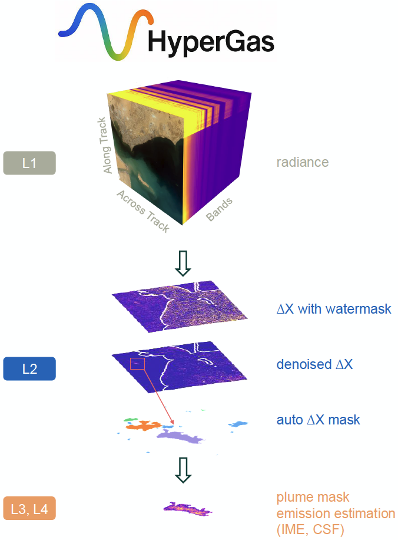

# HyperGas-GMD

## Usage

This repository contains scripts used in the GMD manuscript "HyperGas 1.0: A Python package for analyzing hyperspectral data for greenhouse gases from retrieval to emission rate quantification."

## Notebook structure

- ch4\_mf\_lmf.ipynb

    Fig. 4

- ch4\_emissions.ipynb

    Fig. 10

- calib\_summary.ipynb

    Fig. 7 and Table 2

- calib\_summary\_co2.ipynb

    Table 3

- cluster\_mf.ipynb

    Fig. A1

- co2\_emissions.ipynb

    Fig. 11

- controlled\_releases.ipynb

    Fig. 8

- plumemask.ipynb

    Fig. 5

- scene\_calib.ipynb

    Fig. 6

- watermask.ipynb

    Fig. 2 and 3

## Reference

Zhang, Xin, et al. "HyperGas 1.0: A Python package for analyzing hyperspectral data for greenhouse gases from retrieval to emission rate quantification" (2025, under review).
